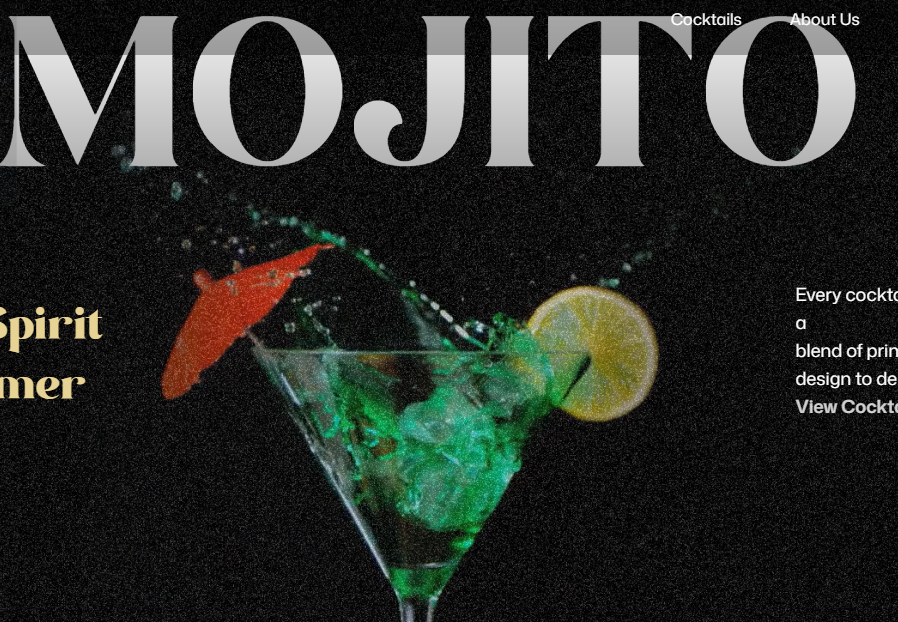

# 🎬 GSAP Animated Website

A visually engaging and highly interactive **frontend web application** built using **React + Vite** and powered by **GSAP animations**. This project demonstrates advanced animation techniques and smooth user experiences for modern web applications.

---

## 🌐 Live Demo

🚀 https://gsap-kw34.vercel.app/

## 📸 Screenshots

## 📸 Screenshots

### 🍹 Mojito Section

---

## 🧠 Overview

This project focuses on creating **smooth, high-performance animations** using GSAP to enhance user interaction and UI experience.

It showcases how animations can make websites more engaging, modern, and visually appealing.

---

## ⚙️ Tech Stack

* **Frontend:** React (Vite)
* **Animations:** GSAP (GreenSock Animation Platform)
* **Styling:** CSS / Tailwind (if used)
* **Deployment:** Vercel

---

## 🔥 Features

### 🎯 Advanced Animations

* Smooth transitions and timeline-based animations
* Scroll-triggered animations
* Element entrance & exit effects

### ⚡ High Performance

* Optimized animations using GSAP
* Minimal lag and smooth rendering

### 📱 Responsive Design

* Works seamlessly across devices

### 🎨 Modern UI/UX

* Clean design with interactive visuals
* Focus on user engagement

---


---

## 🧩 Key GSAP Concepts Used

* Timeline animations
* ScrollTrigger (if used)
* Stagger effects
* Transform & opacity animations

---

## 🛠️ Setup Instructions

### 1. Clone the Repository

```bash
git clone https://github.com/your-username/gsap-project.git
cd gsap-project
```

### 2. Install Dependencies

```bash
npm install
```

### 3. Run the Project

```bash
npm run dev
```

---

## 🌍 Deployment

This project is deployed on **Vercel**

🔗 https://gsap-kw34.vercel.app/

---

## 📈 Future Improvements

* Add more complex animations
* Integrate 3D animations (Three.js)
* Improve performance optimization
* Add page transitions

---

## 👨‍💻 Author

Dhruv Singh

---

## ⭐ Why This Project Stands Out

* Demonstrates strong frontend skills
* Shows practical GSAP usage (rare skill 🔥)
* Focus on UI/UX and animation performance
* Production-ready deployment

---
